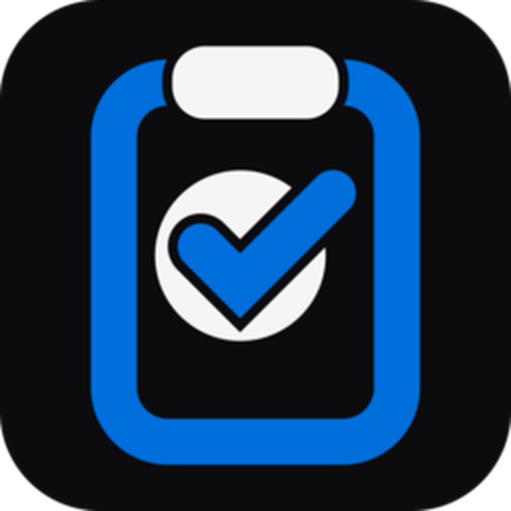

<div align="center">
  
</div>

# `_davCLIPBOARD`

Gestore locale della cronologia appunti per Windows, macOS e Linux.  
Local clipboard history manager for Windows, macOS and Linux.

**v26.10.1 · Stable · Local-first · No telemetry**

Interfaccia e motion system condivisi con `_davSPACE` e la suite `_davstudios`.

## Italiano

`_davCLIPBOARD` monitora il testo copiato, conserva una cronologia locale ricercabile e permette di richiamarla rapidamente da tastiera.

### Funzioni

- Monitoraggio automatico degli appunti di testo.
- Cronologia persistente salvata localmente nei dati dell'app.
- Ricerca istantanea, preferiti, ricopia ed eliminazione.
- Gestione intelligente dei duplicati: un testo già presente viene riportato in cima senza duplicarlo.
- Limite configurabile: 50, 100, 250 o 500 elementi.
- Pulizia automatica opzionale dopo 1, 7, 30 o 90 giorni; i preferiti vengono conservati.
- Scorciatoia globale `Ctrl/Cmd + Shift + V` per aprire l'app e focalizzare la ricerca.
- Navigazione da tastiera: frecce per selezionare, Invio per copiare, `Ctrl/Cmd + F` per cercare.
- Avvio automatico opzionale con il sistema operativo.
- Tema Sistema, Chiaro e Scuro.
- Italiano e English.
- Nessuna telemetria e nessun invio online degli appunti.
- Design, testi, colori, icone e animazioni coerenti con il design system `_davstudios`.

Supporto immagini/file e system tray restano candidati per revisioni successive.

### Installazione delle release GitHub non firmate

Le release di `_davCLIPBOARD` sono distribuite direttamente tramite GitHub e, al momento, non utilizzano certificati commerciali di code signing o notarizzazione Apple. Il codice sorgente è disponibile pubblicamente con licenza MIT.

#### Windows

Windows SmartScreen può mostrare l'avviso **“Windows ha protetto il PC”** perché l'installer non è firmato con un certificato di publisher attendibile. Se hai scaricato il file dalla repository GitHub ufficiale di `_davstudios`, seleziona **Ulteriori informazioni** e poi **Esegui comunque**.

#### macOS

Gatekeeper può impedire la prima apertura perché l'app non è firmata con Developer ID e non è notarizzata da Apple. Dopo aver tentato di aprire l'app, vai in **Impostazioni di Sistema → Privacy e Sicurezza**, individua il messaggio relativo a `_davCLIPBOARD` e scegli **Apri comunque**.

#### Linux

Per un'AppImage può essere necessario rendere il file eseguibile prima dell'avvio:

```bash
chmod +x _davCLIPBOARD*.AppImage
```

Scarica sempre le release dalla repository GitHub ufficiale di `_davstudios`. Quando viene pubblicato un hash SHA-256, puoi usarlo per verificare l'integrità del file scaricato.

### Avvio in sviluppo su Windows

`RUN-WINDOWS.bat`

Oppure:

```bash
npm install --no-audit --no-fund
npm run desktop
```

## English

`_davCLIPBOARD` monitors copied text, keeps a searchable local history and can be recalled quickly from the keyboard.

### Features

- Automatic text clipboard monitoring.
- Persistent local history stored in app data.
- Instant search, favorites, copy-back and deletion.
- Duplicate handling that moves existing clips to the top instead of duplicating them.
- Configurable 50, 100, 250 or 500 item limit.
- Optional cleanup after 1, 7, 30 or 90 days while preserving favorites.
- Global `Ctrl/Cmd + Shift + V` shortcut to open the app and focus search.
- Keyboard navigation with arrows, Enter and `Ctrl/Cmd + F`.
- Optional launch at system startup.
- System, Light and Dark themes.
- Italiano and English.
- No telemetry and no clipboard uploads.
- UI and motion aligned with the shared `_davstudios` design system.

### Installing unsigned GitHub releases

`_davCLIPBOARD` releases are distributed directly through GitHub and currently do not use a commercial code-signing certificate or Apple notarization. The source code is publicly available under the MIT License.

#### Windows

Windows SmartScreen may display **“Windows protected your PC”** because the installer is not signed by a trusted publisher certificate. If you downloaded it from the official `_davstudios` GitHub repository, select **More info** and then **Run anyway**.

#### macOS

Gatekeeper may block the first launch because the app is not signed with Developer ID and is not notarized by Apple. After attempting to open it, go to **System Settings → Privacy & Security**, locate the `_davCLIPBOARD` notice and choose **Open Anyway**.

#### Linux

An AppImage may need executable permission before launch:

```bash
chmod +x _davCLIPBOARD*.AppImage
```

Always download releases from the official `_davstudios` GitHub repository. When a SHA-256 hash is published, you can use it to verify the integrity of the downloaded file.

## Package information

- Developer / Publisher: `_davstudios`
- Homepage: https://davstudios.it
- License: MIT
- Bundle identifier: `studio.dav.clipboard`
- Current version: `26.10.1`

## Support _davstudios

Website: https://davstudios.it  
Buy Me A Coffee: https://buymeacoffee.com/davstudios

## License

MIT — see [`LICENSE`](LICENSE).
